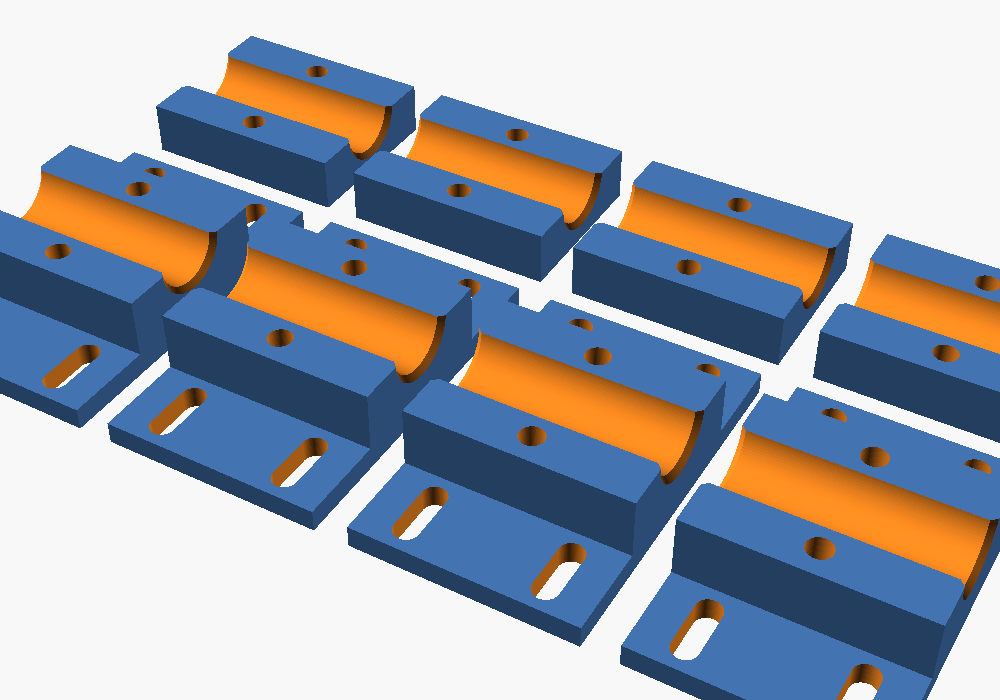

# Mycle Cargo rack clamp mount (Bambu Lab A1)

Two-piece clamp that bolts round a rail on the Mycle Cargo's rear rack and gives
a flat, slotted flange for fixing a crate, deck board, box or basket. Use 4 clamps:
2 on each side rail.

A whole rack can't be printed: the A1 bed is 256 × 256 mm, and the Cargo rack is
rated to 125 kg. So this prints the mounting hardware, not the rack.

## Files

| File | What |
|---|---|
| `rack_clamp_plate_4x_16mm.stl` | One full A1 plate: 4 complete clamps, 224 × 129 × 19 mm |
| `rack_clamp_upper_16mm.stl` / `rack_clamp_lower_16mm.stl` | A single clamp half each |
| `rack_clamp.scad` | Parametric source (OpenSCAD) |

## Before you print: measure the rail

The STLs assume a **16 mm** rail. Mycle doesn't publish the tube size, so measure
yours with calipers. If it's different, open `rack_clamp.scad` in OpenSCAD, set
`tube_d`, set `part` to `plate` (or `upper`/`lower`), render (F6) and export STL.

## Bambu Studio settings

- **Filament:** PETG or ASA. Don't use PLA: it softens in a sunny parked bike and creeps under load.
- **Orientation:** as exported. The flange and cap bottoms sit flat, with the channel facing up. No supports needed.
- **Strength:** 4 walls, 5 top and bottom layers, 40% gyroid infill, 0.2 mm layers.
- **Plate:** textured PEI. Use a glue stick for PETG.

## Hardware (per clamp)

- 2 × M5 × 25 socket-head bolts and 2 × M5 nyloc nuts for the clamp. The nuts sit in the hex pockets in the lower cap.
- Up to 4 × M5 bolts, washers and nuts through the flange slots to hold your crate or board.
- 0.5 mm rubber tape (or inner-tube strip) round the rail to grip and protect the paint.

The halves leave a 1 mm gap, so tightening the bolts clamps the rail. Tighten evenly
until snug and don't crush the part. Check the bolts after the first few rides.

## Limits

These clamps are for light cargo like a crate, shopping or a box. **Don't use them for a
child seat** or anything near the rack's rated load. Use Mycle's or the seat
maker's own fittings for that.
