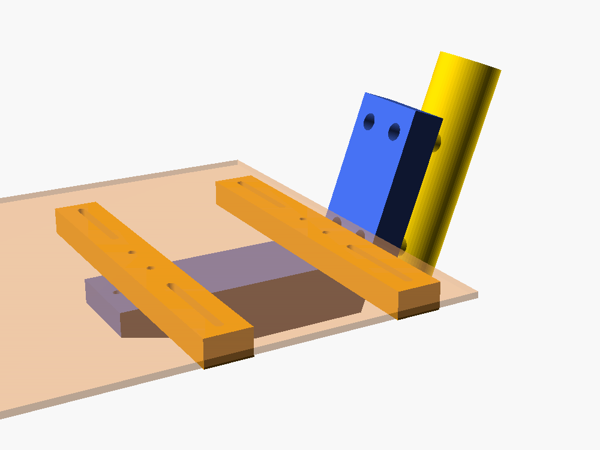
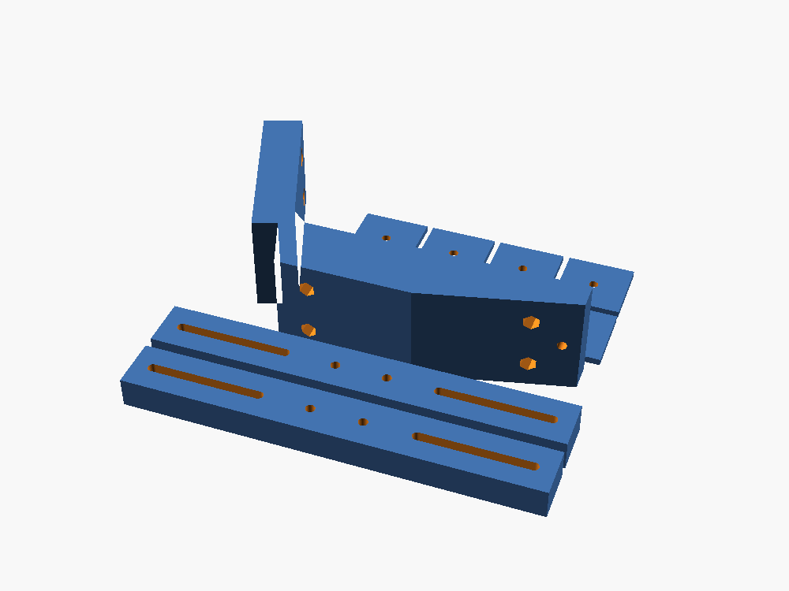

# Mycle Cargo front crate bracket (Bambu Lab A1)

This mounts a Basil bicycle crate on the front of a Mycle Cargo, using the **4 threaded
bosses on the front of the head tube**. These are the same bosses Mycle's own steel front
rack bolts to. No steel rack is needed.

*Yellow is the head tube with its 4 bosses. Blue is the printed bracket, bolted to the
bosses. It sticks forward over the front wheel. Orange is the 2 printed cross arms bolted
on top of the bracket. The crate (pale) sits on the arms and bolts to them.*

The bracket is fixed to the frame, not the fork. The wheel steers underneath it and the
crate stays still, like Mycle's own front rack.

## The parts

| Part | How many | What it does |
|---|---|---|
| Bracket (blue) | 1 | Bolts to the 4 head-tube bosses and reaches 20 cm forward |
| Cross arm (orange) | 2 | Bolts across the top of the bracket, 24 cm wide. The crate sits on these. |
| Washer plate | 8 | Go inside the crate, so the bolts can't pull through the crate floor |

All 11 parts print together on **one A1 plate**: `mycle_front_crate_plate.stl`, 242 × 210 × 60 mm.

## Step 1: print the fit template (10 minutes)

The boss spacing is **estimated from photos**. Print `boss_fit_template.stl` first: a thin
plate with 4 holes. Hold it on the bosses.

- **It drops straight onto all 4:** the spacing is right. Print the main plate.
- **It doesn't fit:** measure centre to centre between the bosses: top to bottom (`boss_v`,
  currently 75 mm) and left to right (`boss_h`, currently 30 mm). Change those two numbers
  at the top of `front_crate_bracket.scad`. Then export both STLs again from OpenSCAD:
  set `part` to `template` then `plate`, render (F6) and export STL each time.

Also check:
- **Bolt size:** try an M6 bolt in a boss. If only M5 fits, set `bolt_d = 5.5` and `head_d = 10`.
- **Head tube angle:** hold a phone level app along the head tube. Set `head_angle` if it isn't about 70°.
  This keeps the crate level.

## Step 2: print the main plate

- **Filament:** PETG or ASA. **Don't use PLA.**
- **Orientation:** as exported. The bracket lies on its side. This is deliberate: the
  layers then run in the same direction as the load, which makes the bracket several times
  stronger than printing it upright. No supports needed.
- **Strength:** 6 walls, 6 top and bottom layers, 50% gyroid infill, 0.2 mm layers.
- **Plate:** textured PEI. Use a glue stick for PETG. Use a brim on the bracket if it lifts at the corners.

## Hardware

| What | How many | For |
|---|---|---|
| M6 × 25 bolts, plus washers | 4 | Bracket to head-tube bosses. Check they reach at least 8 mm into the boss. |
| M5 × 35 bolts and M5 nyloc nuts | 4 | Arms to bracket. The nuts go in the hex pockets under the bracket. |
| M5 × 25 bolts, washers and nyloc nuts | 4–8 | Through the arm slots, the crate floor and a washer plate inside the crate |
| Thread-lock (blue) | | On the 4 boss bolts |

## Fitting

1. **Move the headlight.** It's currently on the fork crown, right under where the
   bracket goes. Bolt it to the M5 hole under the front tip of the bracket instead, as
   Mycle's own rack does.
2. Bolt the bracket to the 4 bosses with thread-lock. Tighten firmly but don't crush the plastic.
3. Bolt the 2 arms across the top of the bracket.
4. Sit the crate on the arms. Bolt it down through the arm slots and the crate floor,
   with a washer plate inside the crate on each bolt.
5. **Check the steering.** Turn the bars all the way left and right. Nothing should touch:
   not the tyre, mudguard, fork, light, handlebars or cables. Pay extra attention to the
   handlebar ends and brake levers against the back of the crate.

## Limits

- **Keep it to about 5 kg in the crate**, which covers shopping and a bag, at least to start.
  A printed part on the front of a bike takes a hammering from bumps.
- Before each ride for the first couple of weeks, grab the crate and rock it. If anything has
  loosened, cracked or turned white at the corner where the bracket meets the head tube,
  stop using it.
- If it ever fails, it lands on the front wheel. For heavy loads, use Mycle's steel front rack.
