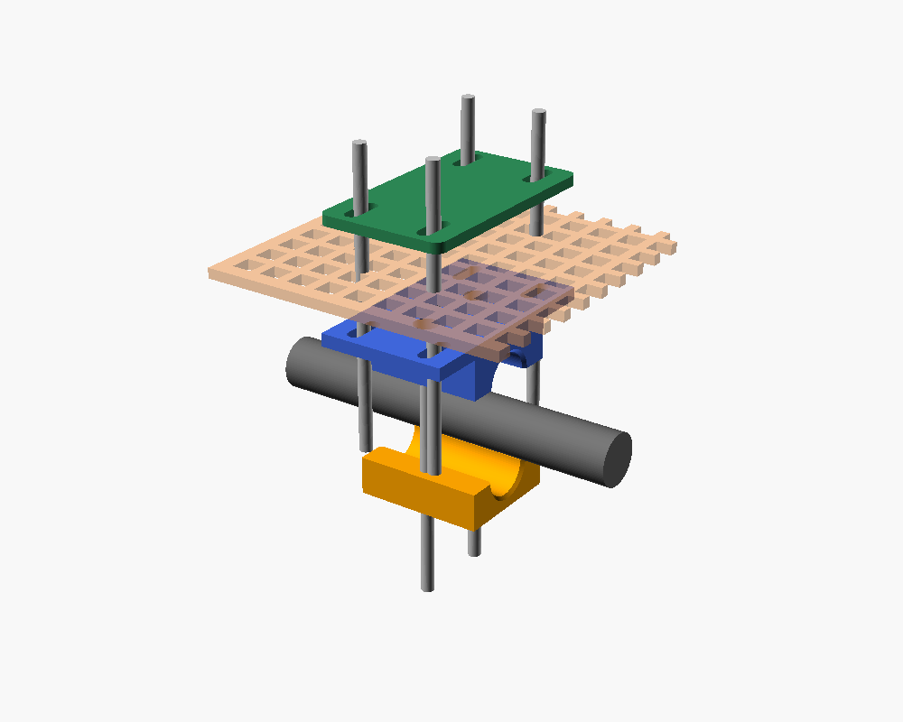

# Mycle Cargo front rack → Basil crate mount (Bambu Lab A1)

This mounts a Basil bicycle crate on the Mycle Cargo's steel front rack. The steel
rack stays on the bike, held by its 4 head-tube screws. Four printed clamps grip the
rack's two long side tubes, 2 per side. The crate sits on the clamps' flat
tops, and M5 bolts go up through the clamp slots and the crate's grid floor. Inside
the crate they go into a printed spreader plate, so the bolts can't pull through the floor.

*One mount pulled apart, top to bottom: green spreader plate (inside the crate), crate floor,
blue clamp top, rack tube (grey), orange clamp bottom. The bolts squeeze it all together. You need 4 of these.*

## Files

Everything for one crate fits on **one A1 plate**: 4 clamps (top and bottom halves) plus 4 spreaders.

| File | Rack tube diameter | Plate footprint |
|---|---|---|
| `mycle_crate_mount_all_16mm.stl` | 16 mm | 224 × 222 mm |
| `mycle_crate_mount_all_18mm.stl` | 18 mm | 224 × 228 mm |
| `mycle_crate_mount_all_20mm.stl` | **20 mm (best guess from photo)** | 224 × 234 mm |
| `mycle_crate_mount_all_22mm.stl` | 22 mm | 224 × 240 mm |
| `rack_clamp.scad` | Any (parametric OpenSCAD source) | |

## Measure first

These sizes are estimated from a photo. Measure the rack's long side tube with calipers
and pick the closest STL. For a ruler-only measurement, wrap a strip of paper round the
tube, measure the length and divide by 3.14.

If your tube falls between sizes, open `rack_clamp.scad` in OpenSCAD and set `tube_d`
(e.g. 19.5) and `part = "all"`. Then render (F6) and export STL.

## Bambu Studio settings

- **Filament:** PETG or ASA. Don't use PLA, which softens in a sunny parked bike.
- **Orientation:** as exported. Everything sits flat and needs no supports.
- **Strength:** 4 walls, 5 top and bottom layers, 40% gyroid infill, 0.2 mm layers.
- **Plate:** textured PEI. Use a glue stick for PETG.

## Hardware (whole crate)

- 8 × M5 × 25 socket-head bolts and 8 × M5 nyloc nuts for the clamps. The nuts sit in the hex pockets in the bottom halves.
- 8–16 × M5 × 20 bolts, washers and nyloc nuts for the crate. They go up from under the clamp flange, through the crate floor and the spreader, with the nut inside the crate.
- 0.5 mm rubber tape or inner-tube strip round the rack tube under each clamp.

## Fitting

1. Wrap the rack's long side tubes where the clamps will go, clear of the welded cross bars.
2. Fit the clamps loosely, 2 per side, about as far apart as the crate floor allows.
3. Sit the crate on top. Slide the clamps along the tubes until the flange slots line up with
   gaps in the crate's grid floor.
4. Bolt the crate down through the spreaders, then tighten the clamp bolts evenly. The
   halves leave a 1 mm gap so they pinch the tube.
5. Turn the bars lock to lock and check the crate doesn't hit anything. Re-check the bolts after the first few rides.

## Limits

Keep to the load printed on the rack's mounting plate. Remember that weight on the front
rack makes the steering heavier.
